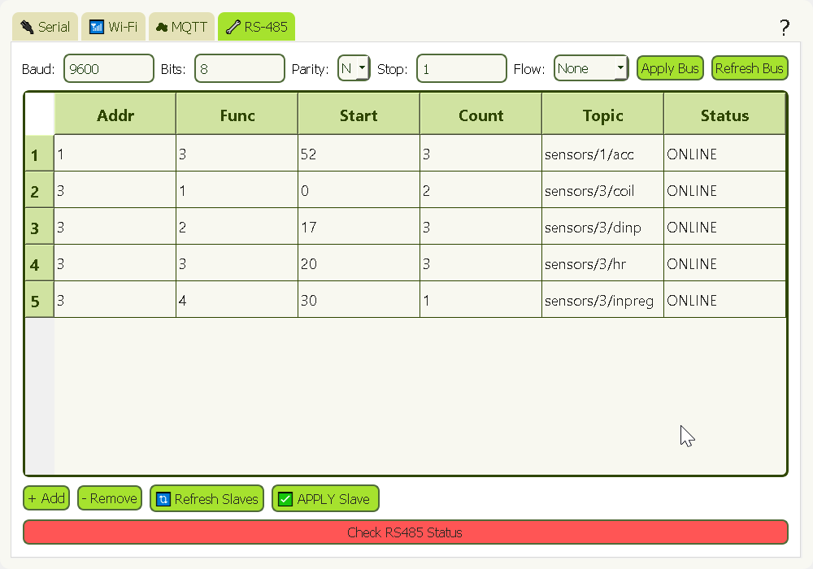

# Modbus_Configuration_GUI_Public

โปรเเกรม Config นี้มีไว้เพื่อการในการตั้งค่า parameter ต่างๆ ในการเชื่อม Wifi, MQTT, RS485 ที่ใช้ในการสื่อสารของเซนเซอร์ที่ใช้สื่อสารผ่าน Modbus RTU (RS485) โดยตัว ESP 32 จะเป็น Master รับข้อมูลจาก sensor มาเเปลงข้อมูลเป็น json เเล้วส่งผ่าน MQTT Server เก็บไว้ของเเต่ละค่าของเเต่ละเซนเซอร์ไว้คนละ topic

## Option สําหรับ RS485

### Bus Config:

- **Baud Rate**: Choose from common values (e.g., 9600,19200,38400,57600,115200).
- **Data Bits**: Typically 7,8 bits.
- **Stop Bits**: Choose either 1 or 2 stop bits.
- **Parity**: Options include None (N), Even (E), Odd (O).
- **Flow Control** None,RTS/CTS

### RS485 Status:

- **Online/Offline Status**: If the status is unknown, use the "CHECK_RS485" command to check the RS485 health.

### Function Code:

- Function codes descriptions
    -   01 (0x01) Read Coils
    -   02 (0x02) Read Discrete Inputs
    -   03 (0x03) Read Holding Registers 
    -   04 (0x04) Read Input Registers  

### Common Issues:

- When OFFLINE appear please at least check 2 times by using RS485 check button then open the serial tab.
- When no data being parse (No value in the table) use refresh slaves button again

